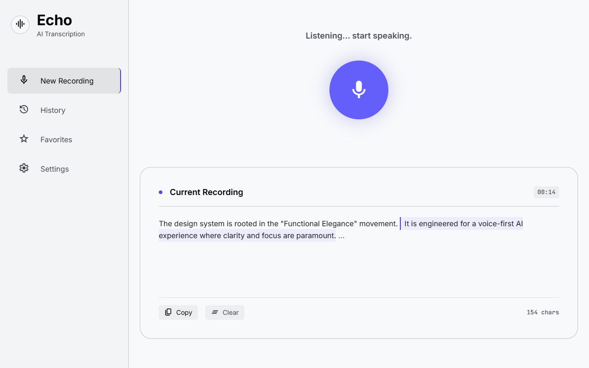
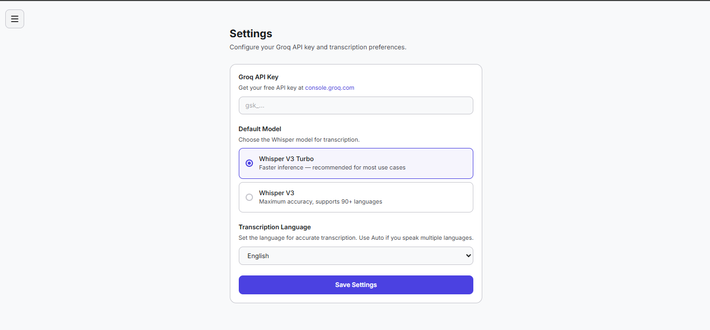

<div align="center">

# Echo

**Voice-first AI transcription web app.**

Speak. Transcribe. Organize.

[](https://nextjs.org)
[](https://typescriptlang.org)
[](https://tailwindcss.com)
[](LICENSE)

</div>

---





---

## What is Echo?

Echo is an open-source, voice-first AI transcription web application. Instead of typing prompts, users speak — Echo transcribes their speech using Whisper models hosted on Groq and saves the results to a local SQLite database.

### Key Features

- **Voice Recording** — One-click mic button with real-time visual feedback
- **AI Transcription** — Powered by Groq Whisper (whisper-large-v3 / whisper-large-v3-turbo)
- **Multi-language Support** — 20+ languages with auto-detect option
- **Transcription History** — Browse, search, and manage all past recordings
- **Favorites** — Bookmark important transcriptions for quick access
- **User Accounts** — Custom JWT authentication with bcrypt password hashing
- **Personal API Keys** — Each user brings their own free Groq API key
- **Docker Support** — One-command deployment with `docker compose up`

---

## Tech Stack

| Layer | Technology |
|---|---|
| Framework | Next.js 16 (App Router) |
| Language | TypeScript |
| Styling | Tailwind CSS 4 |
| Database | SQLite3 (better-sqlite3) |
| Auth | Custom JWT + bcrypt |
| Speech-to-Text | Groq API (Whisper) |
| Icons | Lucide React |
| Package Manager | npm |

---

## Getting Started

### Prerequisites

- **Node.js** 18+ (for manual setup)
- **Docker** (for containerized setup)
- A free **Groq API key** from [console.groq.com](https://console.groq.com)

### Option 1: Manual Setup

```bash
# Clone the repository
git clone <repo-url>
cd echo

# Install dependencies
npm install

# Set up environment variables
cp .env.example .env.local
# Edit .env.local and set a random JWT_SECRET

# Run the development server
npm run dev
```

Open [http://localhost:3000](http://localhost:3000) in your browser.

### Option 2: Docker (Recommended)

```bash
# Clone the repository
git clone <repo-url>
cd echo

# Build and start the container
docker compose up -d
```

Open [http://localhost:3000](http://localhost:3000) in your browser.

The SQLite database is persisted in a Docker volume — your data survives container restarts.

| Command | Description |
|---|---|
| `docker compose up -d` | Start the app in the background |
| `docker compose down` | Stop the app |
| `docker compose up -d --build` | Rebuild with latest changes |

---

## How to Use

1. **Sign up** for an account at `/signup`
2. **Get a free API key** at [console.groq.com](https://console.groq.com)
3. **Add your API key** in Settings — no credit card required
4. **Select your language** in Settings (English is the default)
5. **Click the mic button** and speak
6. **View your transcription** — copy, favorite, or delete it

---

## Project Structure

```
echo/
├── app/
│   ├── (auth)/
│   │   ├── login/page.tsx
│   │   └── signup/page.tsx
│   ├── dashboard/
│   │   ├── page.tsx              # Main transcription UI
│   │   ├── history/page.tsx
│   │   ├── favorites/page.tsx
│   │   └── settings/page.tsx
│   └── api/
│       ├── auth/
│       │   ├── login/route.ts
│       │   ├── signup/route.ts
│       │   └── logout/route.ts
│       ├── transcribe/route.ts
│       ├── recordings/route.ts
│       ├── recordings/[id]/route.ts
│       ├── recordings/[id]/favorite/route.ts
│       ├── settings/route.ts
│       └── me/route.ts
├── components/
│   ├── MicButton.tsx
│   ├── TranscriptCard.tsx
│   ├── Sidebar.tsx
│   └── ModelSelector.tsx
├── lib/
│   ├── db.ts                     # SQLite connection + schema
│   └── auth.ts                   # JWT + bcrypt helpers
├── middleware.ts
├── Dockerfile
├── docker-compose.yml
└── .dockerignore
```

---

## Database Schema

### `users`
| Column | Type | Description |
|---|---|---|
| id | INTEGER | Primary key |
| first_name | TEXT | User's first name |
| last_name | TEXT | User's last name |
| email | TEXT | Unique email |
| password_hash | TEXT | Bcrypt-hashed password |
| created_at | DATETIME | Account creation time |

### `recordings`
| Column | Type | Description |
|---|---|---|
| id | INTEGER | Primary key |
| user_id | INTEGER | FK to users |
| text | TEXT | Transcribed text |
| model | TEXT | Whisper model used |
| duration | REAL | Audio duration (seconds) |
| is_favorite | INTEGER | 0 or 1 |
| created_at | DATETIME | Recording time |

### `user_settings`
| Column | Type | Description |
|---|---|---|
| id | INTEGER | Primary key |
| user_id | INTEGER | FK to users (unique) |
| groq_api_key | TEXT | User's Groq API key |
| default_model | TEXT | Preferred Whisper model |
| language | TEXT | Transcription language |
| updated_at | DATETIME | Last update time |

---

## Environment Variables

```env
# .env.local
JWT_SECRET=your_random_secret_here
DATABASE_PATH=./echo.db
```

> There is no global API key. Each user provides their own Groq API key via the Settings page.

---

## Transcription Languages

Echo supports 21 language options:

| Code | Language | Code | Language |
|---|---|---|---|
| en | English | ko | Korean |
| sw | Swahili | ar | Arabic |
| es | Spanish | hi | Hindi |
| fr | French | it | Italian |
| pt | Portuguese | nl | Dutch |
| de | German | ru | Russian |
| ja | Japanese | tr | Turkish |
| zh | Chinese | pl | Polish |
| | | sv | Swedish |

---

## Groq Free Tier

- 2,000 requests per day
- 7,200 audio seconds per hour
- No credit card required
- Sign up at [console.groq.com](https://console.groq.com)

---

## License

MIT
